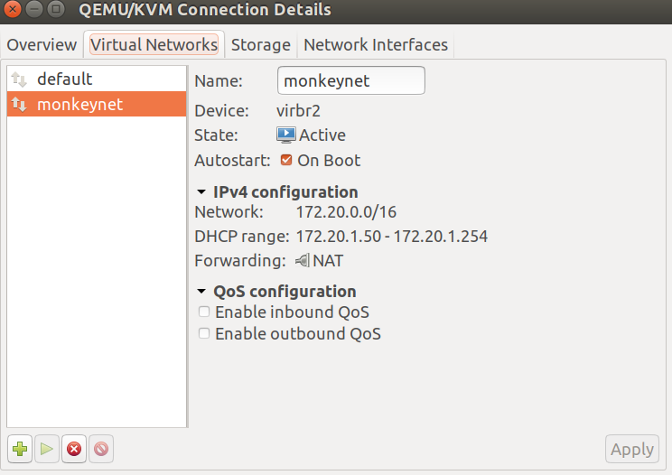
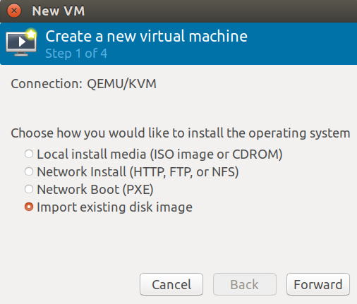
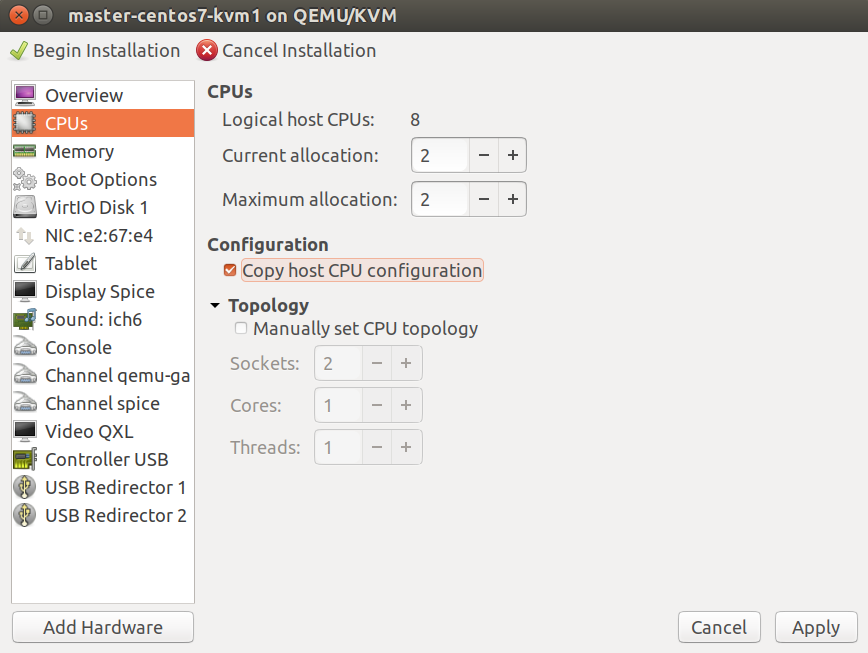

# MonkeyBox by @rhtyd

The goal of this project is to help new CloudStack developers setup development
environment based on ready to use VM boxes.

Notes:
- This guide assumes that you're running a latest debian-based GNU/Linux
  distro such as Ubuntu. This guide was tested with `Ubuntu 17.10`.
- Your laptop/platform has at least 16GB RAM and x86_64 Intel-VT or AMD-V
  enabled CPU so you can run hardware-accelerated nested hypervisors.
- If you've any other hypervisor such as VirtualBox or VMware workstations
  please uninstall it before proceeding further.
- Due to license issues, pre-built KVM-based monkeyboxes are only published.
  Watch this space in sometimes, I'll blog about how to DIY XenServer and
  VMware/ESXi+vCenter (6.5u1) monkeybox.

Pre-built :monkey:boxes can be [downloaded](http://dl.rohityadav.cloud/monkeyboxes/) from:

    http://dl.rohityadav.cloud/monkeyboxes/

Clone the monkeybox repo using:

    $ git clone https://github.com/rhtyd/monkeybox.git

Build an appliance using:

    $ cd <path> && packer build <json fil>

Vagrant boxes are coming soon!

# TODO

- Blog about creating XenServer and ESXi monkeyboxes
- Brief docs on nfs server and storage setup
- Docs on mysql-server setup
- Additional tips, tricks on development
- IDE/editor setup, several docs improvements
- Boxes for CentOS6, Ubuntu, XenServer, ESXi
- Publish on Vagrant cloud, vagrant based workflow?
- End to end setup and verification

## Defaults

Default password for the `root` user is `password`.

These are the default static IPs of the MonkeyBox appliances:

    CentOS7 KVM: 172.20.1.10
    XenServer 6.5: 172.20.1.15

IP range 172.20.1.50-254 is used by DHCP server for dynamic IP allocation.

## Install KVM on your Laptop

Install KVM using following:

    # apt-get install qemu-kvm libvirt-bin bridge-utils cpu-checker
    # kvm-ok

Install `virt-manager`, the virtual machine manager graphical tool to manage VMs
on your machine:

    # apt-get install virt-manager

## MonkeyNet Virtual Networking

For our local dev-test environment, we'll create a 172.20.0.0/16 virtual network
with NAT so VMs on this network are only accessible from the host/laptop but
not by the outside network.

    External Network
      .                     +-----------------+
      |              virbr1 | MonkeyBox VM1   |
      |                  +--| IP: 172.20.1.10 |
    +-----------------+  |  +-----------------+
    | Host x.x.x.x    |--+
    | IP: 172.20.0.1  |  |  +-----------------+
    +-----------------+  +--| MonkeyBox VM2   |
                            | IP: 172.20.x.y  |
                            +-----------------+

We're choosing here 172.20.0.0/16 as the network range because as per RFC1918
it is allowed to be used for private networks. The 192.168.x.x and 10.x.x.x
may be already used by VPN, lab resources and home networks which is why we
need to choose this range.

To keep the setup simple all MonkeyBox VMs have a single nic which can be
used as a single physical network in CloudStack that has the public, private,
management/control and storage networks. A complex setup is possible by adding
multiple virtual networks and nics on them.

### Setup MonkeyNet Virtual Network

Run the following to setup `monkeynet` virtual network as described in above
section:

    $ virsh net-define monkeynet.xml
    $ virsh net-autostart monkeynet
    $ virsh net-start monkeynet

The default network xml definition assumes `virbr1` is not already assigned, in
case you get an error change the bridge name to something other than `virbr1`.

Finally confirm using:

    $ virsh net-list
    Name                 State      Autostart     Persistent
    ----------------------------------------------------------
    default              active     yes           yes
    monkeynet            active     yes           yes

    $ ifconfig virbr1
    virbr1: flags=4099<UP,BROADCAST,MULTICAST>  mtu 1500
        inet 172.20.0.1  netmask 255.255.0.0  broadcast 172.20.255.255
        ether 52:54:00:c4:5b:40  txqueuelen 1000  (Ethernet)
        RX packets 0  bytes 0 (0.0 B)
        RX errors 0  dropped 0  overruns 0  frame 0
        TX packets 0  bytes 0 (0.0 B)
        TX errors 0  dropped 0 overruns 0  carrier 0  collisions 0

Alternatively, you may open `virt-viewer` manager and click on:

    Edit -> Connection Details -> Virtual Networks

Add a virtual network with NAT in 172.20.0.0/16 like below:

This will create a virtual network with NAT with the CIDR 172.20.0.0/16, your
gateway will be `172.20.0.1` which is also your host's virtual bridge IP. The
virtual network's bridge name `virbrX`may be different and it does not matter as long
as you've a NAT-enabled virtual network in 172.20.0.0/16.

## Using MonkeyBox Appliance

Build or download pre-built monkey box appliance and import them as VMs using
virt-viewer by adding a new VM:

Next, select the qcow2 disk image and configure the import for example 8GBs of
RAM and 2 CPU cores, and make sure to select the private virtual network
created before (`monkeynet`):

Before starting the imported appliance, select the option to copy host CPU
configuration which will choose a CPU configuration similar to your host's CPU, i.e.
will allow nested hypervisors:

### Networking

Your base platform (laptop) will have the gateway IP `172.20.0.1`.

Run your favourite IDE/text-editors, your management server, MySQL server, NFS
server (secondary and primary storages) on your host where these services will
be accessible to VMs, KVM hosts etc. at 172.20.0.1.

Once your VM has started, try remote login using: (root:password)

    $ ssh root@172.20.1.10

## CloudStack Development

### Install Development Tools

Run this:

    $ sudo apt-get install openjdk-8-jdk maven python-mysql.connector libmysql-java mysql-server mysql-client bzip2 nfs-common uuid-runtime python-setuptools ipmitool genisoimage

Setup IntelliJ (or any IDE of your choice), get it from here:

    https://www.jetbrains.com/idea/download/#section=linux

Install pyenv, jenv as well.

Setup `aliasrc` that defines some useful bash aliases, exports and utilities
such as `agentscp`. Run the following while in the directory root:

    $ echo "source $PWD/aliasrc" >> ~/.bashrc
    $ echo "source $PWD/aliasrc" >> ~/.zshrc

### Build and Test CloudStack

It's assumed that the directory structure is something like:

        folder
        ├── cloudstack
        └── monkeybox

Fork the repository at: github.com/apache/cloudstack, or get the code:

    $ git clone https://github.com/apache/cloudstack.git

Build using:

    $ mvn clean install -Dnoredist -P developer,systemvm

Deploy database using:

    $ mvn -q -Pdeveloper -pl developer -Ddeploydb

Run management server using:

    $ mvn -pl :cloud-client-ui jetty:run  -Dnoredist -Djava.net.preferIPv4Stack=true

Install marvin:

    $ sudo pip install --upgrade tools/marvin/dist/Marvin*.tar.gz

While in CloudStack's repo's root/top directory, run the folllowing to copy
agent scripts, jars, configs to your KVM host:

    $ cd /path/to/git-repo/root
    $ agentscp 172.20.1.10  # Use the appropriate box IP

Deploy datacenter using:

    $ python tools/marvin/marvin/deployDataCenter.py -i ../monkeybox/adv-kvm.cfg

Example, to run a marvin test:

    $ nosetests --with-xunit --xunit-file=results.xml --with-marvin --marvin-config=../monkeybox/adv-xs.cfg -s -a tags=advanced --zone=KVM-advzone1 --hypervisor=KVM test/integration/smoke/test_vm_life_cycle.py

When you fix an issue, rebuild cloudstack and push new changes to your KVM host
using `agentscp` and if necessary restart the agent using:

    $ agentscp 172.20.1.10
    $ systemctl restart cloudstack-agent

## Author

[Rohit Yadav](http://rohityadav.cloud), rohit@yadav.cloud

## Contributing

Send a pull request on https://github.com/rhtyd/monkeybox
